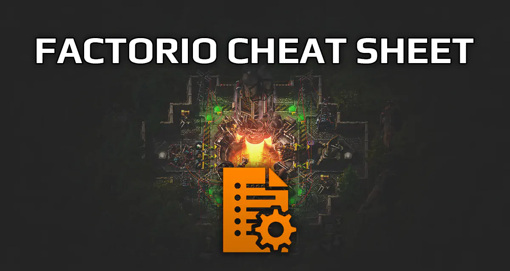
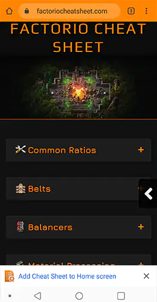
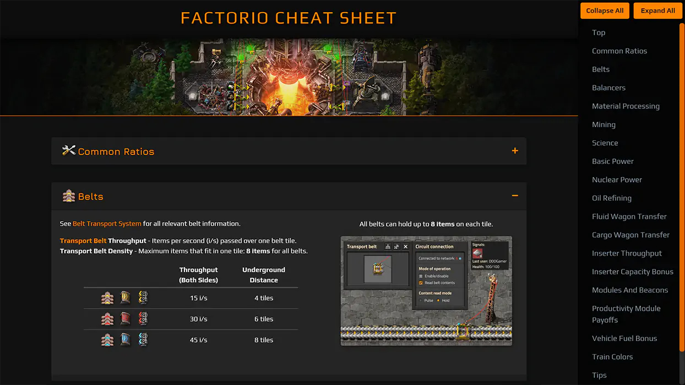

# Factorio [Cheat Sheet App](https://factoriocheatsheet.com/)
Cheat Sheet for [Factorio](https://www.factorio.com/): *"A compendium of the most common Factorio game facts, such as build ratios, tips/tricks, and links to further information".*

If you would like to contribute to the cheat sheet code/content, see `contributing.md`

## Deployments 

* [Master Deployment](https://factoriocheatsheet.com/)
* Master branch is for the source code that's hosted [here](https://deniszholob.github.io/factorio-cheat-sheet/).

This cheat sheet would not be possible without the Factorio community, big thanks to everyone on Reddit, previous cheat sheets, and the Wiki, which all of the data used here is based on.
For anyone who is doing development work with Angular, I hope this project helps you out with the code structure and whatnot.

# Support Me
If you find the cheat sheet or the source code useful, consider supporting me on Patreon.

# Screenshots

